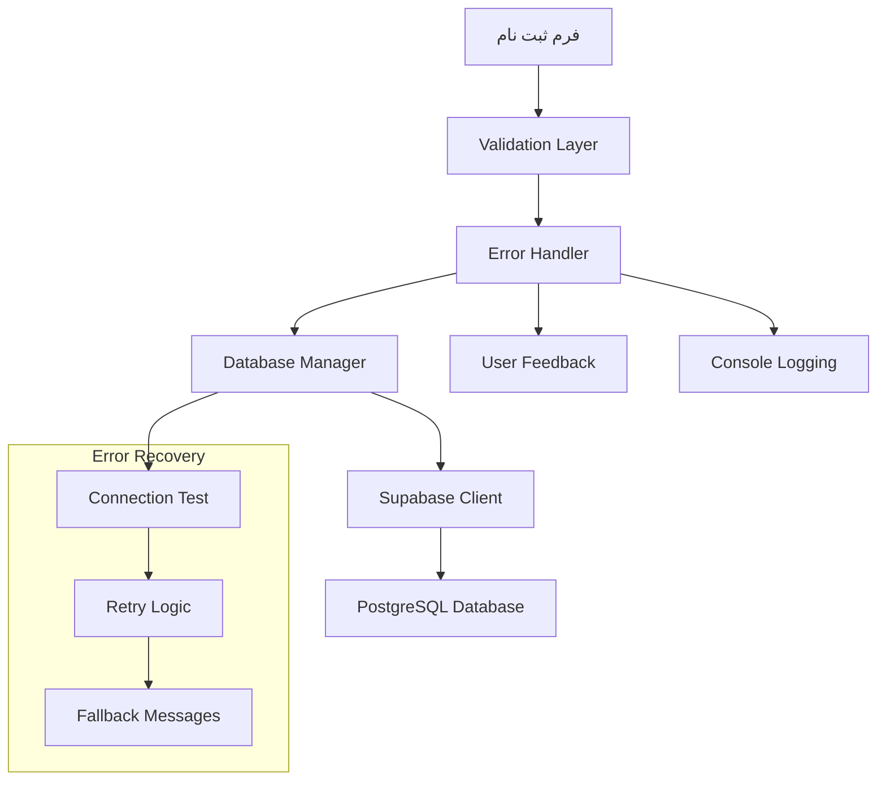

# مستند طراحی

## نمای کلی

این طراحی برای رفع مشکلات موجود در سیستم ثبت نام دانش آموزان ارائه شده است. بر اساس تجزیه و تحلیل کدهای موجود، مشکلات اصلی در موارد زیر شناسایی شده‌اند:

1. عدم مدیریت صحیح خطاهای اتصال به پایگاه داده
2. نبود بررسی وجود جدول `allowed_national_ids` قبل از استفاده
3. عدم مدیریت مناسب خطاهای شبکه و timeout
4. نبود سیستم retry برای درخواست‌های ناموفق
5. عدم validation کامل داده‌ها در سمت کلاینت

## معماری

### معماری کلی سیستم



### لایه‌های سیستم

1. **لایه رابط کاربری (UI Layer)**
   - مدیریت فرم و تعاملات کاربر
   - نمایش پیام‌های خطا و موفقیت
   - نشانگر بارگذاری

2. **لایه اعتبارسنجی (Validation Layer)**
   - بررسی فرمت داده‌ها
   - اعتبارسنجی کد ملی
   - بررسی فیلدهای اجباری

3. **لایه مدیریت خطا (Error Handling Layer)**
   - تشخیص انواع خطاها
   - ارائه پیام‌های مناسب
   - لاگ‌گذاری برای عیب‌یابی

4. **لایه پایگاه داده (Database Layer)**
   - مدیریت اتصال به Supabase
   - عملیات CRUD
   - مدیریت تراکنش‌ها

## اجزا و رابط‌ها

### 1. Enhanced Error Handler

```javascript
class EnhancedErrorHandler {
    // تشخیص نوع خطا
    categorizeError(error)
    
    // ارائه پیام مناسب
    getUserFriendlyMessage(error)
    
    // لاگ‌گذاری تفصیلی
    logError(error, context)
    
    // بررسی قابلیت retry
    isRetryable(error)
}
```

### 2. Connection Manager

```javascript
class ConnectionManager {
    // تست اتصال
    async testConnection()
    
    // بررسی وضعیت جداول
    async verifyTables()
    
    // ایجاد جداول در صورت عدم وجود
    async ensureTablesExist()
    
    // retry logic
    async executeWithRetry(operation, maxRetries)
}
```

### 3. Enhanced Validation

```javascript
class ValidationManager {
    // اعتبارسنجی کامل فرم
    validateStudentForm(data)
    
    // بررسی real-time فیلدها
    setupRealTimeValidation()
    
    // اعتبارسنجی کد ملی پیشرفته
    validateNationalIdAdvanced(nationalId)
    
    // بررسی دسترسی کد ملی
    async checkNationalIdAccess(nationalId)
}
```

### 4. Database Manager بهبود یافته

```javascript
class EnhancedDatabaseManager extends DatabaseManager {
    // بررسی وجود جداول
    async checkTablesExist()
    
    // ایجاد جداول با مدیریت خطا
    async createTablesWithErrorHandling()
    
    // ثبت دانش آموز با retry
    async registerStudentWithRetry(studentData)
    
    // مدیریت تراکنش
    async executeTransaction(operations)
}
```

## مدل‌های داده

### Student Data Model

```typescript
interface StudentData {
    firstName: string;
    lastName: string;
    fatherName: string;
    nationalId: string; // 10 digits
    className: string;
    address: string;
    medicalConditions?: string;
    fatherJob: string;
    motherJob: string;
    fatherPhone: string; // 09xxxxxxxxx
    motherPhone: string; // 09xxxxxxxxx
    studentPhone?: string; // 09xxxxxxxxx
}
```

### Error Response Model

```typescript
interface ErrorResponse {
    type: 'validation' | 'network' | 'database' | 'permission' | 'unknown';
    code: string;
    message: string;
    userMessage: string;
    retryable: boolean;
    context?: any;
}
```

### Connection Status Model

```typescript
interface ConnectionStatus {
    isConnected: boolean;
    tablesExist: boolean;
    lastChecked: Date;
    errors: string[];
}
```

## مدیریت خطا

### انواع خطاها و راه‌حل‌ها

1. **خطاهای اتصال شبکه**
   - تشخیص: `NetworkError`, `fetch failed`
   - راه‌حل: Retry با backoff، پیام "مشکل در اتصال اینترنت"

2. **خطاهای پایگاه داده**
   - تشخیص: `PGRST` codes، `permission denied`
   - راه‌حل: بررسی دسترسی‌ها، ایجاد جداول

3. **خطاهای اعتبارسنجی**
   - تشخیص: `duplicate key`, `invalid format`
   - راه‌حل: پیام‌های واضح، راهنمایی کاربر

4. **خطاهای دسترسی**
   - تشخیص: `401`, `403` status codes
   - راه‌حل: بررسی API key، تنظیم RLS policies

### استراتژی Retry

```javascript
const retryConfig = {
    maxRetries: 3,
    baseDelay: 1000, // 1 second
    maxDelay: 5000,  // 5 seconds
    backoffFactor: 2,
    retryableErrors: [
        'NetworkError',
        'TimeoutError',
        'PGRST301' // temporary server error
    ]
};
```

## استراتژی تست

### 1. تست‌های واحد (Unit Tests)

- تست اعتبارسنجی کد ملی
- تست فرمت‌دهی شماره تلفن
- تست تشخیص نوع خطا
- تست منطق retry

### 2. تست‌های یکپارچگی (Integration Tests)

- تست اتصال به Supabase
- تست عملیات CRUD
- تست مدیریت تراکنش
- تست سناریوهای خطا

### 3. تست‌های رابط کاربری (UI Tests)

- تست فرم ثبت نام
- تست نمایش پیام‌های خطا
- تست نشانگر بارگذاری
- تست validation real-time

### 4. تست‌های عملکرد (Performance Tests)

- تست زمان پاسخ
- تست تحت بار
- تست memory leaks
- تست timeout handling

## بهینه‌سازی‌ها

### 1. بهینه‌سازی شبکه

- Connection pooling
- Request batching
- Caching strategies
- Compression

### 2. بهینه‌سازی UI/UX

- Progressive loading
- Optimistic updates
- Better error messages
- Accessibility improvements

### 3. بهینه‌سازی پایگاه داده

- Index optimization
- Query optimization
- Connection management
- Transaction optimization

## امنیت

### 1. اعتبارسنجی ورودی

- Sanitization
- Type checking
- Length validation
- Format validation

### 2. مدیریت دسترسی

- RLS policies
- API key management
- Rate limiting
- CORS configuration

### 3. حفاظت از داده‌ها

- Data encryption
- Secure transmission
- Audit logging
- Backup strategies

## نظارت و لاگ‌گذاری

### 1. لاگ‌های عملیاتی

- User actions
- Database operations
- Error occurrences
- Performance metrics

### 2. لاگ‌های عیب‌یابی

- Detailed error traces
- Request/response data
- Connection status
- Validation results

### 3. متریک‌های عملکرد

- Response times
- Success rates
- Error rates
- User engagement